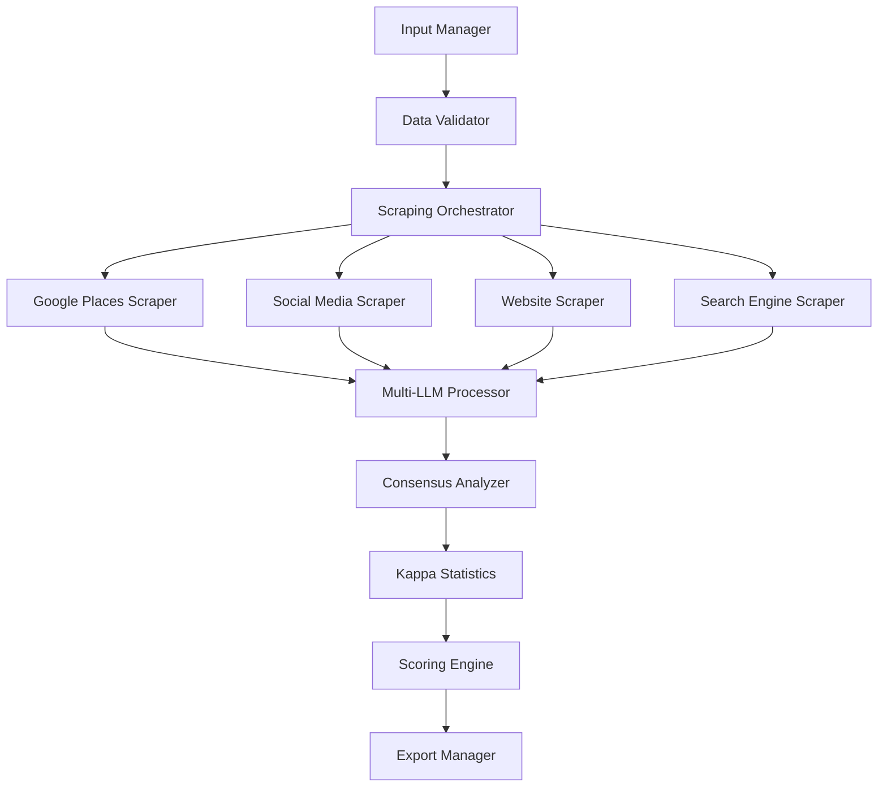

# PRD - GDR Framework Etapa 1
**Product Requirements Document**

---

## 📋 Informações do Documento

| Campo | Valor |
|-------|-------|
| **Versão** | 1.0.0 |
| **Data** | Agosto 2025 |
| **Status** | MVP - Etapa 1 |
| **Responsável** | Equipe GDR |
| **Revisão** | Quinzenal |

---

## 🎯 1. Visão Geral

### 1.1 Objetivo do MVP
Desenvolver a **Etapa 1** do framework GDR que automatiza a coleta, enriquecimento e consolidação de dados de contato de leads empresariais através de múltiplas fontes e validação multi-LLM.

### 1.2 Escopo da Etapa 1
- **Input**: Planilha Excel com dados básicos de leads
- **Processamento**: Coleta multi-fonte + consenso multi-LLM
- **Output**: Dados enriquecidos com scoring de qualidade
- **Tecnologia**: Python + APIs disponíveis

### 1.3 Fora do Escopo (Etapas Futuras)
- ❌ Análise geográfica avançada (buffer analysis)
- ❌ Computer Vision / Street View
- ❌ Dashboard web interativo
- ❌ Automação de outreach

---

## 🏗️ 2. Arquitetura do Sistema

### 2.1 Componentes Principais



### 2.2 Stack Tecnológico

| Componente | Tecnologia | Justificativa |
|------------|------------|---------------|
| **Backend** | Python 3.8+ | Ecosystem robusto para IA/ML |
| **Data Processing** | Pandas, NumPy | Manipulação eficiente de dados |
| **HTTP Requests** | aiohttp, requests | Scraping assíncrono |
| **LLM Integration** | openai, anthropic, google-generativeai | APIs oficiais |
| **Statistics** | scikit-learn, scipy | Análise Kappa |
| **Export** | openpyxl, xlsxwriter | Excel profissional |
| **Config** | python-dotenv | Gestão de variáveis |

---

## 📊 3. Modelo de Dados

### 3.1 Input Schema (Planilha de Entrada)

```python
class LeadInput:
    original_id: str           # legalDocument (CNPJ)
    original_nome: str         # name
    original_endereco_completo: str  # street+number+district+city+state
    original_telefone: str     # phone
    original_website: str      # website (opcional)
    original_email: str        # email (opcional)
    # Campos Google Places (se disponíveis)
    original_telefone_place: str
    original_avaliacao_google: float
    original_latitude: float
    original_longitude: float
```

### 3.2 Collected Data Schema

#### 3.2.1 Dados de Redes Sociais (Apify)
```python
class SocialMediaData:
    # Facebook
    gdr_facebook_url: str
    gdr_facebook_mail: str
    gdr_facebook_whatsapp: str
    gdr_facebook_id: str
    gdr_facebook_username: str
    gdr_facebook_followers: int
    gdr_facebook_likes: int
    gdr_facebook_category: str
    gdr_facebook_bio: str
    gdr_facebook_is_verified: bool
    
    # Instagram
    gdr_instagram_url: str
    gdr_instagram_id: str
    gdr_instagram_username: str
    gdr_instagram_followers: int
    gdr_instagram_following: int
    gdr_instagram_bio: str
    gdr_instagram_is_verified: bool
    gdr_instagram_is_business: bool
    
    # Linktree
    gdr_linktree_username: str
    gdr_linktree_title: str
    gdr_linktree_description: str
    gdr_linktree_social_urls: list
    gdr_linktree_links_details: dict
    
    # LinkedIn
    gdr_linkedin_url: str
```

#### 3.2.2 Dados de Website
```python
class WebsiteData:
    gdr_cwral4ai_url: str
    gdr_cwral4ai_email: str
    gdr_cwral4ai_telefone: str
    gdr_cwral4ai_whatsapp: str
    gdr_cwral4ai_youtube_url: str
```

#### 3.2.3 Dados de Search Engine
```python
class SearchEngineData:
    gdr_google_search_engine_url: str
    gdr_google_search_engine_email: str
    gdr_google_search_engine_telefone: str
    gdr_google_search_engine_whatsapp: str
    gdr_google_search_engine_youtube_url: str
```

### 3.3 Consensus Data Schema

#### 3.3.1 Dados Consolidados
```python
class ConsolidatedData:
    gdr_concenso_url: str
    gdr_concenso_email: str
    gdr_concenso_telefone: str
    gdr_concenso_whatsapp: str
    gdr_concenso_total_campos_originais: int
    gdr_concenso_total_campos_enriquecidos: int
    gdr_concenso_novos_campos_adicionados: int
    gdr_concenso_synergy_score_categoria: str
    gdr_concenso_synergy_score_justificativa: str
```

#### 3.3.2 Análise Estatística Kappa
```python
class KappaAnalysis:
    # Métricas Gerais
    gdr_kappa_overall_score: float  # 0-1
    gdr_kappa_interpretation: str   # Poor/Fair/Moderate/Good/Very Good
    gdr_kappa_confidence_interval: tuple
    gdr_kappa_p_value: float
    
    # Concordância por Campo
    gdr_kappa_email_score: float
    gdr_kappa_telefone_score: float
    gdr_kappa_whatsapp_score: float
    gdr_kappa_website_score: float
    
    # Concordância Pairwise LLMs (10 combinações)
    gdr_kappa_openai_claude_score: float
    gdr_kappa_openai_gemini_score: float
    gdr_kappa_openai_deepseek_score: float
    gdr_kappa_openai_zhipuai_score: float
    gdr_kappa_claude_gemini_score: float
    gdr_kappa_claude_deepseek_score: float
    gdr_kappa_claude_zhipuai_score: float
    gdr_kappa_gemini_deepseek_score: float
    gdr_kappa_gemini_zhipuai_score: float
    gdr_kappa_deepseek_zhipuai_score: float
    
    # Flags de Qualidade
    gdr_kappa_high_confidence_flag: bool    # Kappa > 0.7
    gdr_kappa_review_required_flag: bool    # Kappa < 0.4
    gdr_kappa_partial_consensus_flag: bool
    gdr_kappa_outlier_detection_flag: bool
    
    # Confiabilidade por LLM
    gdr_kappa_most_reliable_llm: str
    gdr_kappa_least_reliable_llm: str
```

---

## ⚙️ 4. Especificações Funcionais

### 4.1 RF001 - Input Data Processing
**Descrição**: Sistema deve processar planilhas Excel com dados de leads

**Critérios de Aceite**:
- ✅ Aceitar formato .xlsx
- ✅ Validar campos obrigatórios (ID, nome, endereço)
- ✅ Tratar encoding (UTF-8)
- ✅ Validar CNPJ format
- ✅ Processar até 1000 leads por execução

**Input**: Planilha Excel
**Output**: Lista de objetos LeadInput validados

### 4.2 RF002 - Google Places Data Collection
**Descrição**: Enriquecer dados através da Google Places API

**Critérios de Aceite**:
- ✅ Buscar por nome + endereço
- ✅ Coletar telefone, website, reviews
- ✅ Obter coordenadas (lat/lng)
- ✅ Rate limiting (100 requests/second)
- ✅ Retry logic para falhas temporárias

**APIs Utilizadas**: Google Places API
**Rate Limits**: 100 req/s

### 4.3 RF003 - Social Media Data Collection
**Descrição**: Coletar dados de redes sociais via Apify

**Critérios de Aceite**:
- ✅ Instagram: perfil, followers, bio, links
- ✅ Facebook: página, likes, categoria, contatos
- ✅ Linktree: links, descrição, contatos
- ✅ LinkedIn: URL do perfil
- ✅ Tratamento de perfis privados/inexistentes

**APIs Utilizadas**: Apify Instagram/Facebook/Linktree scrapers
**Rate Limits**: Conforme planos Apify

### 4.4 RF004 - Website Content Extraction
**Descrição**: Extrair informações de contato de websites

**Critérios de Aceite**:
- ✅ Detectar emails via regex
- ✅ Detectar telefones (formatos BR)
- ✅ Detectar WhatsApp
- ✅ Encontrar links YouTube
- ✅ Respeitar robots.txt
- ✅ Timeout de 30s por site

**Tecnologia**: Beautiful Soup + requests
**Patterns**: Regex para emails/telefones BR

### 4.5 RF005 - Search Engine Data Collection
**Descrição**: Buscar informações adicionais via Google Custom Search

**Critérios de Aceite**:
- ✅ Buscar por nome da empresa
- ✅ Extrair snippets com contatos
- ✅ Filtrar resultados relevantes
- ✅ Deduplica informações

**APIs Utilizadas**: Google Custom Search API
**Rate Limits**: 100 queries/day (free tier)

### 4.6 RF006 - Multi-LLM Consensus Processing
**Descrição**: Processar dados coletados através de múltiplos LLMs

**Critérios de Aceite**:
- ✅ Integrar 5 LLMs: OpenAI, Claude, Gemini, DeepSeek, ZhipuAI
- ✅ Prompt padronizado para consolidação
- ✅ Output estruturado (JSON)
- ✅ Timeout de 60s por LLM
- ✅ Fallback para LLMs indisponíveis

**LLMs Suportados**:
- OpenAI GPT-4
- Anthropic Claude 3.5
- Google Gemini Pro
- DeepSeek Chat
- ZhipuAI ChatGLM

### 4.7 RF007 - Statistical Consensus Analysis
**Descrição**: Calcular concordância entre LLMs usando estatística Kappa

**Critérios de Aceite**:
- ✅ Kappa score geral (todos os LLMs)
- ✅ Kappa pairwise (10 combinações)
- ✅ Kappa por campo (email, telefone, etc.)
- ✅ Intervalos de confiança (95%)
- ✅ Interpretação automática (Poor/Fair/Good/etc.)
- ✅ Detecção de outliers

**Biblioteca**: scikit-learn.metrics
**Métricas**: Cohen's Kappa, Fleiss' Kappa

### 4.8 RF008 - Quality Scoring & Flagging
**Descrição**: Gerar scores de qualidade e flags automáticos

**Critérios de Aceite**:
- ✅ Synergy score por categoria
- ✅ Justificativa textual
- ✅ Flags de alta/baixa confiança
- ✅ Flags para revisão manual
- ✅ Ranking de confiabilidade por LLM

### 4.9 RF009 - Data Export
**Descrição**: Exportar resultados em múltiplos formatos

**Critérios de Aceite**:
- ✅ Excel (.xlsx) com múltiplas abas
- ✅ CSV delimitado
- ✅ JSON estruturado
- ✅ Metadados de processamento
- ✅ Logs de execução

---

## 🔧 5. Especificações Técnicas

### 5.1 Arquitetura de Classes

```python
# Core Framework
class GDRFramework:
    def __init__(self, config: GDRConfig)
    def process_leads_file(self, file_path: str) -> ProcessingResults
    def process_leads_batch(self, leads: List[LeadInput]) -> ProcessingResults

# Data Collection
class ScrapingOrchestrator:
    def __init__(self, scrapers: List[BaseScraper])
    def collect_lead_data(self, lead: LeadInput) -> CollectedData

class GooglePlacesScraper(BaseScraper):
    def scrape(self, lead: LeadInput) -> GooglePlacesData

class SocialMediaScraper(BaseScraper):
    def scrape(self, lead: LeadInput) -> SocialMediaData

# LLM Processing
class MultiLLMProcessor:
    def __init__(self, llm_providers: List[BaseLLM])
    def process_lead(self, lead_data: CollectedData) -> LLMResponses

class ConsensusAnalyzer:
    def analyze_consensus(self, responses: LLMResponses) -> ConsensusResult
    def calculate_kappa_scores(self, responses: LLMResponses) -> KappaAnalysis
```

### 5.2 Configuração do Sistema

```python
@dataclass
class GDRConfig:
    # API Keys
    google_maps_api_key: str
    openai_api_key: str
    anthropic_api_key: str
    gemini_api_key: str
    deepseek_api_key: str
    zhipuai_api_key: str
    apify_api_key: str
    
    # Processing Settings
    max_concurrent_scrapers: int = 5
    llm_timeout: int = 60
    retry_attempts: int = 3
    kappa_confidence_level: float = 0.95
    
    # Quality Thresholds
    high_confidence_threshold: float = 0.7
    review_required_threshold: float = 0.4
```

### 5.3 Rate Limiting & Error Handling

```python
class RateLimiter:
    def __init__(self, requests_per_second: int)
    async def acquire(self) -> None
    
class RetryHandler:
    def __init__(self, max_attempts: int, backoff_factor: float)
    async def execute_with_retry(self, func: Callable) -> Any
```

---

## 📈 6. Métricas e KPIs

### 6.1 Métricas Operacionais

| Métrica | Target | Descrição |
|---------|--------|-----------|
| **Processing Time** | < 30s por lead | Tempo total de processamento |
| **Success Rate** | > 95% | Taxa de sucesso geral |
| **Data Coverage** | > 85% | % de leads com dados enriquecidos |
| **LLM Consensus** | > 70% com Kappa > 0.6 | Taxa de consenso adequado |

### 6.2 Métricas de Qualidade

| Métrica | Target | Descrição |
|---------|--------|-----------|
| **Contact Validation** | > 90% | Taxa de validação de contatos |
| **High Confidence** | > 80% | % leads com alta confiança |
| **Review Required** | < 10% | % leads necessitando revisão |
| **Synergy Score** | Média > 0.7 | Score médio de qualidade |

### 6.3 Métricas por Scraper

| Scraper | Success Rate Target | Average Response Time |
|---------|-------------------|---------------------|
| **Google Places** | > 98% | < 2s |
| **Social Media** | > 80% | < 10s |
| **Website** | > 75% | < 15s |
| **Search Engine** | > 85% | < 5s |

---

## 🧪 7. Plano de Testes

### 7.1 Testes Unitários
```python
# test_scrapers.py
def test_google_places_scraper()
def test_social_media_scraper()
def test_website_scraper()

# test_llm_processing.py
def test_multi_llm_consensus()
def test_kappa_calculation()

# test_data_validation.py
def test_lead_input_validation()
def test_output_data_integrity()
```

### 7.2 Testes de Integração
- Teste end-to-end com dados reais
- Teste de rate limiting
- Teste de fallback de APIs
- Teste de export em múltiplos formatos

### 7.3 Testes de Performance
- Load testing com 1000 leads
- Memory usage profiling
- API response time monitoring

---

## 🚀 8. Plano de Deployment

### 8.1 Ambiente de Desenvolvimento
```bash
# Setup local
python -m venv gdr-venv
source gdr-venv/bin/activate
pip install -r requirements.txt
cp .env.example .env
# Configurar APIs keys
```

### 8.2 Ambiente de Produção
- **Containerização**: Docker
- **Orquestração**: Docker Compose
- **Monitoramento**: Logs estruturados
- **Backup**: Dados processados

### 8.3 CI/CD Pipeline
1. **Commit** → Trigger pipeline
2. **Tests** → Unit + Integration
3. **Build** → Docker image
4. **Deploy** → Production environment

---

## 🔒 9. Segurança e Compliance

### 9.1 Proteção de API Keys
- Variáveis de ambiente (.env)
- Rotação regular de chaves
- Monitoring de uso

### 9.2 Data Privacy
- Processamento conforme LGPD
- Não armazenamento de dados sensíveis
- Logs anonimizados

### 9.3 Rate Limiting
- Respeito aos limites das APIs
- Implementação de backoff exponencial
- Monitoring de quotas

---

## 📋 10. Critérios de Aceite do MVP

### 10.1 Funcionalidades Core
- ✅ Processar planilha .xlsx com 100+ leads
- ✅ Coletar dados de todas as fontes configuradas
- ✅ Consolidar via 5 LLMs diferentes
- ✅ Calcular Kappa scores com interpretação
- ✅ Exportar resultados em Excel/CSV/JSON

### 10.2 Performance
- ✅ Processar 100 leads em < 50 minutos
- ✅ Taxa de sucesso > 90%
- ✅ Kappa médio > 0.5 (Moderate agreement)

### 10.3 Qualidade
- ✅ Cobertura de enriquecimento > 80%
- ✅ Validação de dados estruturados
- ✅ Flags automáticos funcionais
- ✅ Logs de auditoria completos

---

**Documento aprovado para implementação**  
*Próxima revisão: 2 semanas*