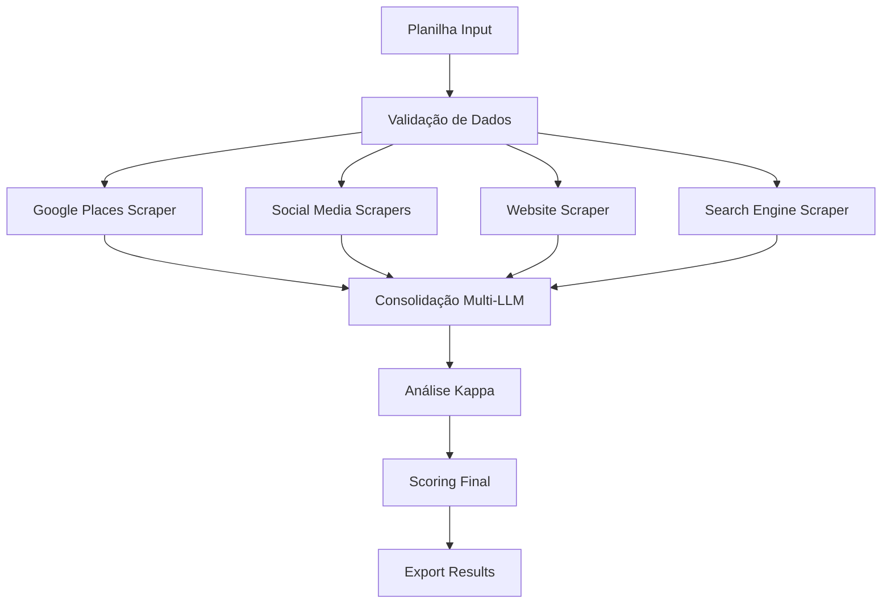

# GDR - Generative Development Representative


## 🎯 Visão Geral

O **GDR (Generative Development Representative)** é um framework de IA que automatiza a função de SDR/BDR, realizando coleta, enriquecimento e qualificação inteligente de leads através de múltiplas fontes de dados e consenso multi-LLM.

### Funcionalidades Principais
- ✅ **Coleta Automatizada**: Scraping de Google Places, redes sociais e websites
- ✅ **Enriquecimento Multi-Fonte**: Consolidação de dados de contato (email, telefone, WhatsApp, website)
- ✅ **Consenso Multi-LLM**: Validação através de OpenAI, Claude, Gemini, DeepSeek e ZhipuAI
- ✅ **Análise Estatística**: Kappa score para medir concordância entre LLMs
- ✅ **Scoring Inteligente**: Qualificação automática de leads com synergy score

## 🚀 Quick Start

### Pré-requisitos
```bash
Python 3.8+
pip install -r requirements.txt
```

### Instalação
```bash
# Clone o repositório
git clone https://github.com/your-org/gdr-framework.git
cd gdr-framework

# Instalar dependências
pip install -r requirements.txt

# Configurar variáveis de ambiente
cp .env.example .env
# Editar .env com suas chaves de API
```

### Uso Básico
```python
from gdr import GDRFramework

# Inicializar o framework
gdr = GDRFramework()

# Processar planilha de leads
results = gdr.process_leads_file('data/input/base-lead_amostra_v2.xlsx')

# Exportar resultados enriquecidos
gdr.export_results(results, 'data/output/leads_enriquecidos.xlsx')
```

## 📁 Estrutura do Projeto

```
gdr-framework/
├── src/
│   ├── core/
│   │   ├── __init__.py
│   │   ├── gdr_main.py          # Framework principal
│   │   └── config.py            # Configurações
│   ├── collectors/
│   │   ├── __init__.py
│   │   ├── google_places.py     # Scraper Google Places
│   │   ├── social_media.py      # Scrapers redes sociais (Apify)
│   │   ├── website_scraper.py   # Scraper de websites
│   │   └── search_engine.py     # Google Search scraper
│   ├── llm/
│   │   ├── __init__.py
│   │   ├── llm_manager.py       # Gerenciador multi-LLM
│   │   ├── consensus.py         # Análise de consenso
│   │   └── kappa_analysis.py    # Estatística Kappa
│   ├── utils/
│   │   ├── __init__.py
│   │   ├── data_validator.py    # Validação de dados
│   │   └── export_manager.py    # Exportação de resultados
│   └── models/
│       ├── __init__.py
│       └── lead_model.py        # Modelos de dados
├── data/
│   ├── input/                   # Planilhas de entrada
│   └── output/                  # Resultados processados
├── tests/
│   ├── test_collectors.py
│   ├── test_llm.py
│   └── test_consensus.py
├── docs/
│   ├── PRD.md                   # Product Requirements Document
│   └── API_REFERENCE.md         # Referência das APIs
├── requirements.txt
├── .env.example
├── .gitignore
├── setup.py
└── README.md
```

## 🔧 Configuração

### Variáveis de Ambiente (.env)
```bash
# Google APIs
GOOGLE_MAPS_API_KEY=your_google_maps_key
GOOGLE_CSE_API_KEY=your_google_cse_key
GOOGLE_CSE_ID=your_search_engine_id

# LLM APIs
OPENAI_API_KEY=your_openai_key
ANTHROPIC_API_KEY=your_anthropic_key
GEMINI_API_KEY=your_gemini_key
DEEPSEEK_API_KEY=your_deepseek_key
ZHIPUAI_API_KEY=your_zhipuai_key

# Scraping APIs
APIFY_API_KEY=your_apify_key
APIFY_API_KEY_LINKTREE=your_apify_linktree_key

# Configurações
INPUT_DIR=./data/input
OUTPUT_DIR=./data/output
```

### Formato da Planilha de Entrada

O sistema aceita planilhas Excel (.xlsx) com as seguintes colunas obrigatórias:

| Campo | Descrição | Exemplo |
|-------|-----------|---------|
| `legalDocument` | CNPJ da empresa | 12.345.678/0001-90 |
| `name` | Nome da empresa | Tech Solutions LTDA |
| `street` | Endereço | Rua das Flores, 123 |
| `city` | Cidade | São Paulo |
| `state` | Estado | SP |
| `phone` | Telefone | (11) 9999-9999 |

## 💻 Exemplos de Uso

### Processamento Básico
```python
from gdr import GDRFramework

# Configurar o framework
gdr = GDRFramework(
    enable_google_places=True,
    enable_social_media=True,
    enable_website_scraping=True,
    llm_consensus_threshold=0.7
)

# Processar leads
leads_file = 'data/input/leads.xlsx'
results = gdr.process_leads_file(leads_file)

print(f"Processados: {len(results)} leads")
print(f"Enriquecidos: {len([r for r in results if r.enriched_data])}")
```

### Análise de Consenso
```python
from gdr.llm import ConsensusAnalyzer

analyzer = ConsensusAnalyzer()

# Analisar consenso entre LLMs
consensus_results = analyzer.analyze_llm_consensus(llm_responses)

print(f"Kappa Score: {consensus_results.kappa_overall_score}")
print(f"Interpretação: {consensus_results.kappa_interpretation}")
print(f"Alta concordância: {consensus_results.kappa_high_confidence_flag}")
```

### Customização de Scrapers
```python
from gdr.collectors import SocialMediaScraper

# Configurar scraper personalizado
scraper = SocialMediaScraper(
    platforms=['instagram', 'facebook', 'linkedin'],
    rate_limit=60,  # requests por minuto
    retry_attempts=3
)

# Executar scraping
social_data = scraper.scrape_lead_social_media(lead_info)
```

## 📊 Outputs e Relatórios

### Variáveis de Saída

#### Dados Originais
```python
original_id, original_nome, original_endereco_completo,
original_telefone, original_website, original_email
```

#### Dados Coletados por Fonte
```python
# Redes Sociais (Apify)
gdr_facebook_url, gdr_facebook_mail, gdr_facebook_whatsapp,
gdr_instagram_url, gdr_instagram_followers, gdr_instagram_bio,
gdr_linktree_title, gdr_linktree_links_details

# Website
gdr_cwral4ai_email, gdr_cwral4ai_telefone, gdr_cwral4ai_whatsapp

# Google Search
gdr_google_search_engine_email, gdr_google_search_engine_telefone
```

#### Consenso e Análise Kappa
```python
# Dados Consolidados
gdr_concenso_email, gdr_concenso_telefone, gdr_concenso_whatsapp,
gdr_concenso_website

# Métricas Kappa
gdr_kappa_overall_score, gdr_kappa_interpretation,
gdr_kappa_confidence_interval, gdr_kappa_high_confidence_flag

# Scoring Final
gdr_concenso_synergy_score_categoria, gdr_concenso_synergy_score_justificativa
```

### Formatos de Exportação
- **Excel (.xlsx)**: Planilha completa com todos os dados
- **CSV**: Para integração com outros sistemas
- **JSON**: Para APIs e integrações programáticas

## 🔄 Pipeline de Processamento



## 🧪 Testes

```bash
# Executar todos os testes
python -m pytest tests/

# Executar testes específicos
python -m pytest tests/test_collectors.py -v

# Testes com coverage
python -m pytest --cov=src tests/
```

## 📈 Monitoramento e Métricas

### KPIs Operacionais
- Taxa de sucesso por scraper
- Tempo médio de processamento por lead
- Taxa de consenso entre LLMs (Kappa > 0.7)
- Cobertura de enriquecimento de dados

### Métricas de Qualidade
- Synergy Score médio por batch
- Taxa de validação de contatos
- Campos novos adicionados por lead
- Precisão dos dados consolidados

## 🛠️ Desenvolvimento

### Adicionando Novos Scrapers
```python
from gdr.collectors.base import BaseScraper

class CustomScraper(BaseScraper):
    def scrape(self, lead_data):
        # Implementar lógica de scraping
        return enriched_data
```

### Adicionando Novos LLMs
```python
from gdr.llm.base import BaseLLM

class CustomLLM(BaseLLM):
    def analyze_lead(self, lead_data):
        # Implementar análise com novo LLM
        return analysis_result
```

## 🔒 Segurança e Compliance

- **Rate Limiting**: Respeitamos limites das APIs
- **Data Privacy**: Dados processados conforme LGPD
- **API Keys**: Armazenamento seguro em variáveis de ambiente
- **Audit Trail**: Log completo de todas as operações

## 📝 Changelog

### v1.0.0 (MVP)
- ✅ Framework core implementado
- ✅ Scrapers Google Places, Apify, Website
- ✅ Consenso multi-LLM (5 provedores)
- ✅ Análise estatística Kappa
- ✅ Export para Excel/CSV/JSON

### v1.1.0 (Planned)
- 🔄 Computer Vision para Street View
- 🔄 Análise geográfica avançada  
- 🔄 Dashboard web interativo
- 🔄 API REST para integrações

## 🤝 Contribuindo

1. Fork o projeto
2. Crie uma branch (`git checkout -b feature/nova-funcionalidade`)
3. Commit suas mudanças (`git commit -am 'Adiciona nova funcionalidade'`)
4. Push para a branch (`git push origin feature/nova-funcionalidade`)
5. Abra um Pull Request

## 📄 Licença

Este projeto está sob a licença MIT. Veja o arquivo [LICENSE](LICENSE) para detalhes.

## 📞 Suporte

- **Documentação**: [docs/](docs/)
- **Issues**: [GitHub Issues](https://github.com/your-org/gdr-framework/issues)
- **Email**: support@gdr-framework.com

---

**Made with ❤️ by GDR Team**